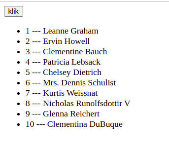

# FUN User Listing!

- Use Only class components!
- Create a dynamic user listing!

- Make it look actually good!
- Make it look **better** than the example!
- Show a LOT of data about the user!
- Maybe use Bootstrap OR use your own custom CSS!
- Have fun styling your application!

- Your application should render only a button!
- When the user clicks that button, you should load a list of users!
- Load the users from https://jsonplaceholder.typicode.com/users !

- Good luck!
- HAVE FUN!
- **HAVE FUN!!**

-----

**🦩**